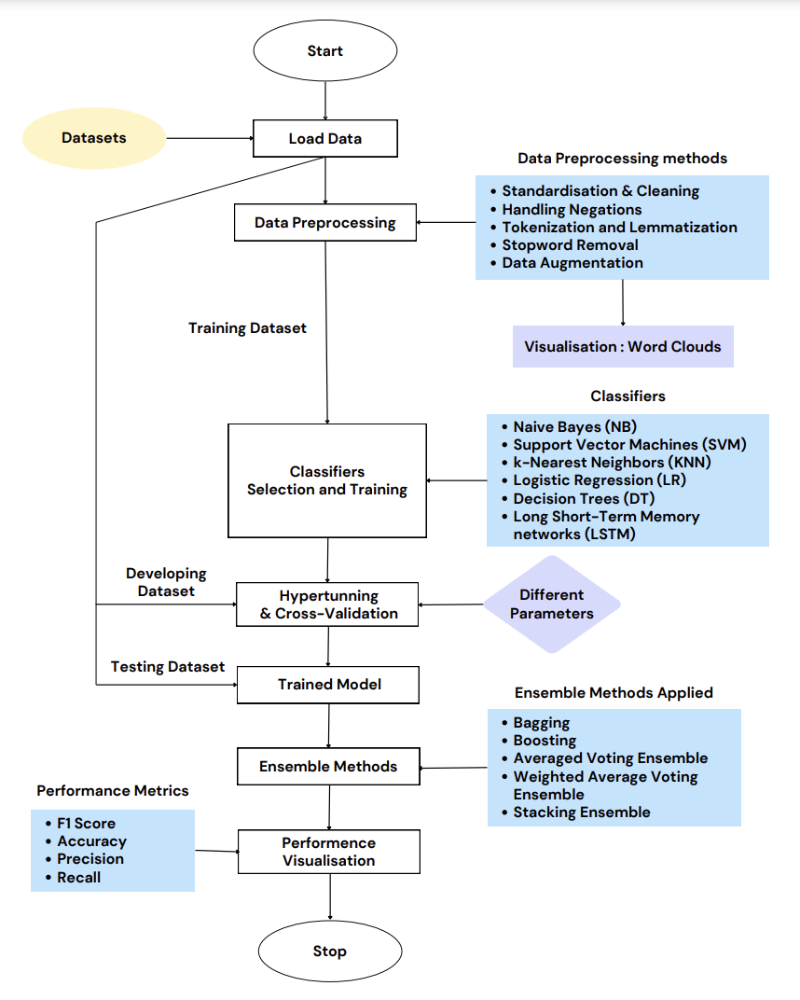

# Twitter Sentiment Analysis Project

A comprehensive sentiment analysis project implementing multiple machine learning approaches to classify tweets into positive, negative, and neutral sentiments. Features extensive preprocessing techniques, traditional ML classifiers, deep learning (LSTM), and ensemble methods.

## Project Overview
- Analysis of Twitter sentiment data using various ML approaches
- Implementation of multiple preprocessing techniques
- Comparison of different classification methods
- Development and evaluation of ensemble models
- In-depth performance analysis and model selection

## Project Workflow
The project follows a structured workflow for sentiment analysis, as illustrated in the diagram below:

## Key Features
### Preprocessing Techniques
- Text cleaning and standardization
- Negation handling
- Tokenization and lemmatization
- Stop word removal
- Data augmentation for class balancing

### Machine Learning Models
- Traditional Classifiers:
  - Naive Bayes (NB)
  - Logistic Regression (LR)
  - Support Vector Machines (SVM)
  - k-Nearest Neighbors (KNN)
  - Decision Trees (DT)
- Deep Learning:
  - Long Short-Term Memory (LSTM)
- Ensemble Methods:
  - Bagging
  - Boosting
  - Voting (Average and Weighted)
  - Stacking

## Technical Stack
### Core Technologies
- Python
- TensorFlow/PyTorch
- Scikit-learn

### Key Libraries
- NLTK: Text preprocessing
- pandas: Data manipulation
- numpy: Numerical operations
- wordcloud: Text visualization
- seaborn/matplotlib: Data visualization
- scikit-learn: Machine learning models
- TensorFlow/PyTorch: Deep learning

### Implementation Techniques
- TF-IDF Vectorization
- Cross-validation
- Hyperparameter tuning
- Model ensembling
- Performance metrics evaluation

## Results & Findings
### Model Performance Comparison
| Model                 | F1 Score | Accuracy (%) | Precision | Recall |
|----------------------|----------|--------------|-----------|---------|
| NB - Original        | 0.64     | 71.82        | 0.65      | 0.64    |
| NB - Tuned          | 0.65     | 72.26        | 0.66      | 0.65    |
| NB - Bagged         | 0.65     | 72.26        | 0.66      | 0.65    |
| LR - Original       | 0.72     | 77.37        | 0.73      | 0.72    |
| LR - Tuned          | 0.71     | 76.93        | 0.72      | 0.71    |
| LR - Bagged         | 0.71     | 76.93        | 0.72      | 0.71    |
| SVM - Original      | 0.70     | 76.05        | 0.71      | 0.70    |
| SVM - Tuned         | 0.71     | 76.49        | 0.72      | 0.71    |
| SVM - Bagged        | 0.70     | 76.05        | 0.71      | 0.70    |
| KNN - Original      | 0.61     | 69.16        | 0.62      | 0.61    |
| KNN - Tuned         | 0.63     | 70.48        | 0.64      | 0.63    |
| KNN - Bagged        | 0.62     | 69.60        | 0.63      | 0.62    |
| DT - Original       | 0.63     | 70.48        | 0.64      | 0.63    |
| DT - Tuned          | 0.64     | 71.37        | 0.65      | 0.64    |
| DT - Bagged         | 0.69     | 75.17        | 0.70      | 0.69    |
| DT - Boosted        | 0.68     | 74.29        | 0.69      | 0.68    |
| LSTM - Original     | 0.70     | 76.05        | 0.71      | 0.70    |
| LSTM - Tuned        | 0.69     | 75.61        | 0.70      | 0.69    |
| Average Ensemble    | 0.72     | 77.37        | 0.73      | 0.72    |
| Weighted Ensemble   | 0.73     | 77.81        | 0.74      | 0.73    |
| Stacking Ensemble   | 0.74     | 78.25        | 0.75      | 0.74    |

### Key Performance Insights

#### Best Performing Models
- **Stacking Ensemble**: Achieved highest overall performance (F1: 0.74)
  - Successfully leveraged strengths of multiple base models
  - Most balanced precision-recall trade-off
  - Demonstrated robust performance across all metrics

- **Logistic Regression**: Strong performer (F1: 0.72)
  - Excellent baseline performance
  - Competitive with more complex models
  - Computationally efficient

#### Model Category Analysis
1. **Linear Models**
   - Consistently strong performance
   - Logistic Regression outperformed more complex alternatives
   - SVM showed robust results with minimal tuning required

2. **Tree-based Models**
   - Basic Decision Trees showed moderate performance
   - Bagging significantly improved DT performance
   - Boosting showed marginal improvements over basic trees

3. **Deep Learning**
   - LSTM performed well but not significantly better than simpler models
   - Tuning didn't yield expected improvements
   - Higher computational cost for minimal gains

4. **Ensemble Methods**
   - Progressive improvement from averaging to weighted to stacking
   - Demonstrated value of combining multiple models
   - Most robust against class imbalance

#### Implementation Insights
- Preprocessing crucial for model performance
- Class imbalance handling improved all models
- Feature engineering more impactful than model complexity
- Simple models often matched or outperformed complex ones

#### Practical Considerations
- Trade-off between performance and computational cost
- Stacking Ensemble recommended for accuracy-critical applications
- Logistic Regression suitable for resource-constrained scenarios
- Model selection should consider specific use case requirements
